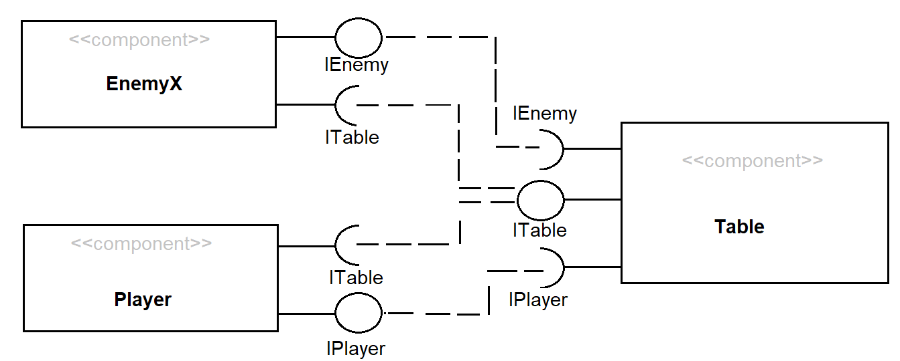
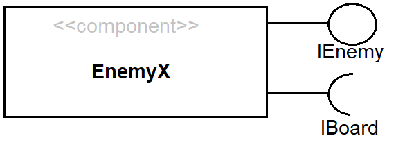
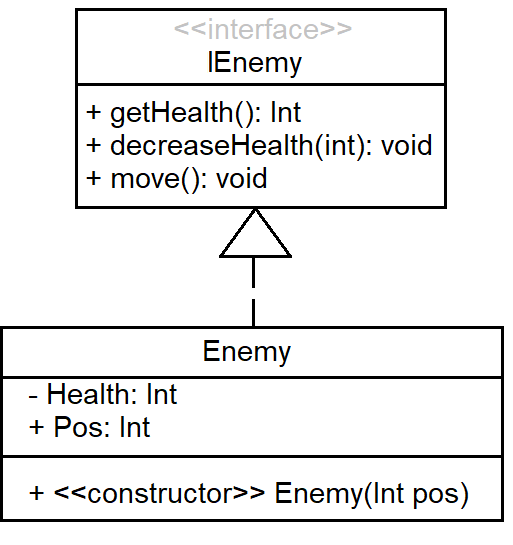
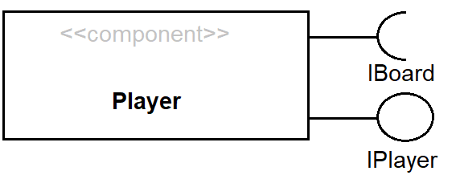
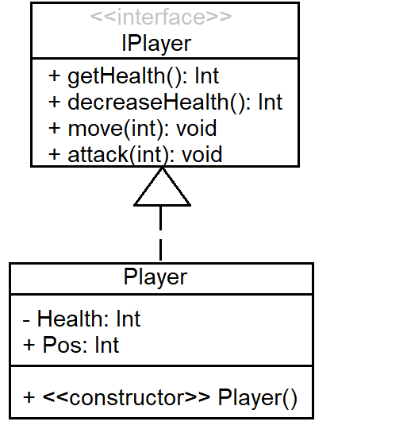
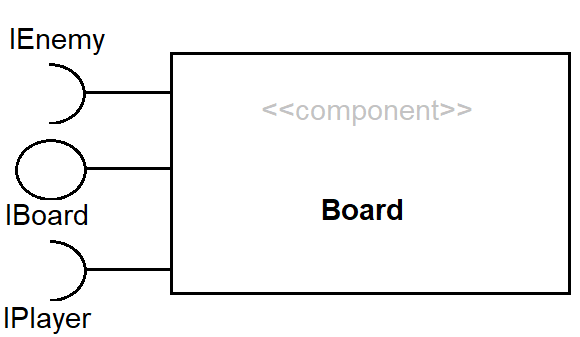
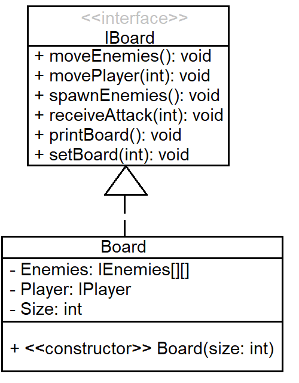

# Projeto Undead Survival

# Equipe
* Gabriel Costa Kinder - 234720

# Descrição Resumida do Projeto
Undead Survival é um jogo celular de sobrevivência e estratégia baseado em turnos.

# Vídeo do Projeto
[Breve video explicativo do projeto](https://drive.google.com/open?id=14vn7SfmNX47Of_C4Yxt0i782d_3f-4OM)

# Diagrama Geral de Componentes

## Componente Enemy/Player - Board

Este é o diagrama compondo componentes bases para o jogo:

# Componente EnemyX

## Interfaces

Interfaces associadas a esse componente:

# Componente Player

## Interfaces

Interfaces associadas a esse componente:

# Componente Board

## Interfaces

Interfaces associadas a esse componente:

# Detalhamento das Interfaces

## Interface IEnemy
Interface geral para todos os inimigos.

Método | Objetivo
-------| --------
getHealth() | Retorna a vida do inimigo.
decreaseHealth(int) | Decresce a vida do inimigo pelo valor recebido.
move() | Move o inimigo em direção ao jogador

## Interface IPlayer
Interface geral para todos os inimigos.

Método | Objetivo
-------| --------
getHealth() | Retorna a vida do jogador.
decreaseHealth(int) | Decresce a vida do jogador pelo valor recebido.
move(int) | Move o jogador na direção especificada.
attack(int) | Ataca os inimigos na direção especificada

## Interface IBoard
Interface geral para todos os inimigos.

Método | Objetivo
-------| --------
moveEnemies() | Aciona a função move de todos os inimigos em campo.
movePlayer(int) | Modifica a posição do jogador.
spawnEnemies() | Cria mais monstros em campo.
receiveAttack(int) | Verifica o ataque do jogador e decresce a vida dos inimigos quando necessário.
printBoard() | Imprime o campo na tela.
setBoard(int) | Arruma o campo de tamanho int para a posição inicial.
