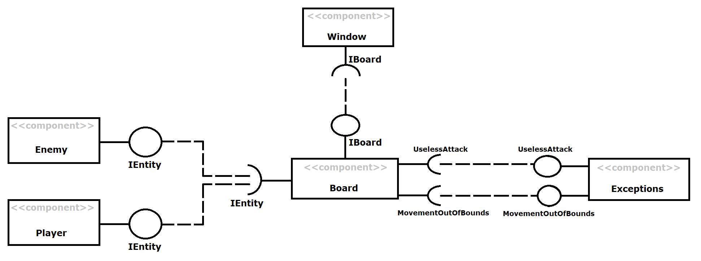
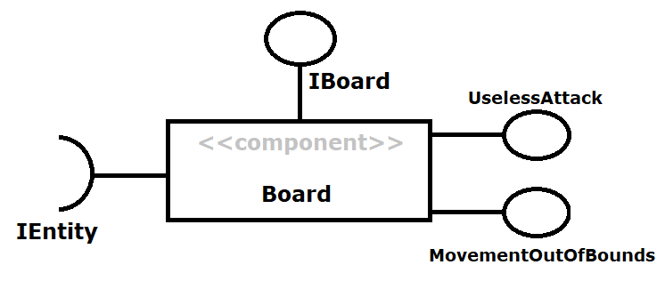

# Projeto Undead Survival

# Equipe
* Gabriel Costa Kinder - 234720

# Descrição Resumida do Projeto
Undead Survival é um jogo celular de sobrevivência e estratégia baseado em turnos onde o jogador deve tentar permanecer vivo pelo maior número de turnos possível contra uma horda interminável de mortos vivos.

# Vídeo e Slides do Projeto

## Vídeo da prévia

[Breve video com as ideias iniciais do projeto](https://drive.google.com/open?id=14vn7SfmNX47Of_C4Yxt0i782d_3f-4OM)

[Slides referentes ao vídeo](https://drive.google.com/open?id=1IdngQ_egM3FmIH6DUdBX8-OqHsMU-bQJ)

## Vídeo do jogo

To be Added

# Diagrama Geral de Componentes

Este é o diagrama compondo componentes bases para o jogo:

## Diagrama Exceptions

Este é o diagrama compondo as classes de exceções existentes no jogo:

# Componente Enemy/Player

## Interfaces

Interfaces associadas a esse componente:

# Componente Board

## Interfaces

Interfaces associadas a esse componente:

# Detalhamento das Interfaces

## Interface IEntity
Interface geral para todos os inimigos.

Método | Objetivo
-------| --------
getCoordX() | Retorna a coordenada em X da entidade.
getCoordY() | Retorna a coordenada em Y da entidade.
incrementCoordX(int inc) | Incrementa a coordenada X da entidade em inc.
incrementCoordY(int inc) | Incrementa a coordenada Y da entidade em inc.
getType() | Retorna uma string contendo o tipo de entidade.

## Interface IBoard
Interface do campo.

Método | Objetivo
-------| --------
getTableSize() | Retorna o tamanho do campo.
getTurns() | Retorna quantos turnos se passaram no jogo.
getEntities() | Retorna um vetor bidimensional de entidades em suas respectivas posições no campo.
movePlayer(char direction) | Movimenta o jogador na direção especificada e procede com os turnos dos oponentes; Retorna 0 caso o jogador morra.
playerAttack(char direction) | Remove a unidade na direção especificada em relação ao jogador e procede com os turnos dos oponentes; Retorna 0 caso o jogador morra.
