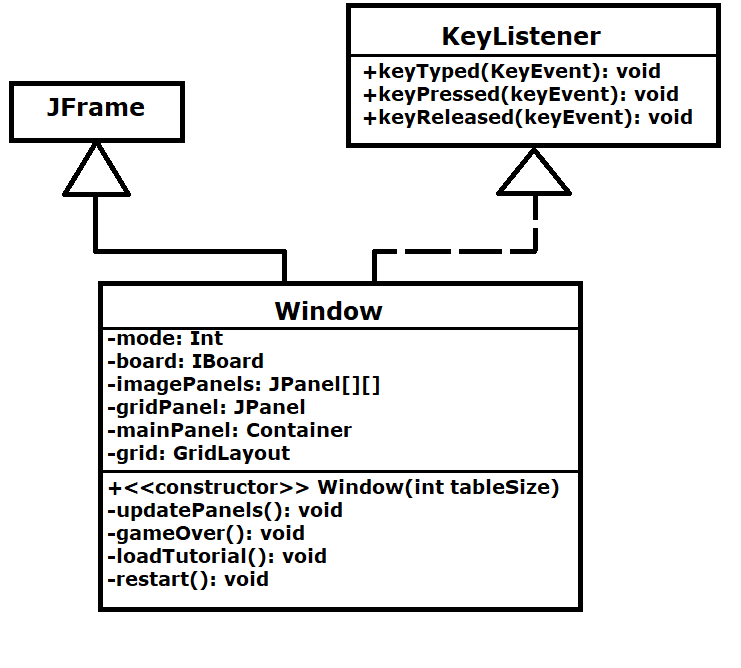

# Projeto Undead Survival

# Equipe
* Gabriel Costa Kinder - 234720

# Descrição Resumida do Projeto
Undead Survival é um jogo celular de sobrevivência e estratégia baseado em turnos onde o jogador deve tentar permanecer vivo pelo maior número de turnos possível contra uma horda interminável de mortos vivos.

# Vídeo e Slides do Projeto

## Vídeo da prévia

[Breve video com as ideias iniciais do projeto](https://drive.google.com/open?id=14vn7SfmNX47Of_C4Yxt0i782d_3f-4OM)

[Slides referentes ao vídeo](https://drive.google.com/open?id=1IdngQ_egM3FmIH6DUdBX8-OqHsMU-bQJ)

## Vídeo do jogo

[Vídeo demonstrando o jogo](https://drive.google.com/file/d/1mIIrYCA06YPccaW-oJHd89ocLE6z1wA4/view?usp=sharing)

## Relatório de Evolução

Durante a execução do projeto foi adotado uma posição dinâmica quanto a mundanças necessárias/melhorias para o projeto. Desta forma, durante sua execução, muitas vezes foram necessários mundanças de rumo.

Uma das principais mudanças de rumo foi a de reiniciar o jogo sem reabri-lo, visto que o jogo funciona como um minigame, curto, dinâmico e para ser repetido diversas vezes. Desta forma, reabri-lo a cada partida era um grande problema.

Porém, a tarefa de conseguir reiniciar o jogo através do pressionamento de um botão vindo do usuário foi uma das maiores dificuldades encontradas para o término do projeto, visto que, da forma que a classe Window era construída antes de tal mudança, era muito difícil qualquer tipo de reinicialização.

Isso requeriu, portanto, grandes melhorias na classe e uma série de aprendizados que demonstraram o por que da importância da modularização, prática muito comum dentro da programação orientada a objetos.

# Destaques de Código

## Tutorial com a espera do pressionamento de um botão:

~~~java
    private void loadTutorial() {
        ...
        while(mode == 0) {  // Waits for mode to change (Keyboard input) to finish the task and load the game
            try {
                Thread.sleep(200);
            } catch (InterruptedException e) {
                e.printStackTrace();
            }
        }
    }
    
    ...
    
    public void keyTyped(KeyEvent keyEvent) {
        if(mode == 0) {  // While in tutorial mode, any key changes to game mode
            mode = 1;
        }
        ...
    }
~~~

> <Destaque demonstrando como foi criado a espera até o pressionamento de um botão sem consumir 100% do CPU (por isso a necessidade do "Thread.Sleep(...)".>

## Aleatoriedade para aparição dos inimigos

~~~java
    private void spawnEnemies() {
        if(nEnemies > 5) // If there is already 6 or more enemies on the board, doesnt spawn more
            return;
        Random random = new Random();
        int randomInt = random.nextInt(turns*5);
        if(randomInt >= 100) {  // Spawns 4 enemies, can only happen from turn 20 onwards
            ...
        } else if (randomInt >= 75) {  // Spawns 3 enemies, can only happen from turn 15 onwards
            ...
        // Spawns 2 enemies, can only happen on turn 8 onwards. Always happen when there are no enemies left on the board
        } else if (randomInt >= 40 || nEnemies == 0) {
            ...
        } else if (randomInt >= 15) {  // Spawns 1 enemy on the board, can only happen from turn 3 onwards
            ...
        }
    }
~~~

> <Destaque demonstrando como foi criado a aparição aleatória de inimigos que aumenta a cada turno que se passa. Além disso, dentro de cada if nas reticências, é novamente utilizado a função random para escolher um canto de forma aleatória também.>

## Atualização de paineis do jogo

~~~java
private void updatePanels() {
        gridPanel.removeAll();  // Deletes all images loaded on grids to rebuild the board

        for(int i = 0; i < board.getTableSize(); i++) {
            for(int j = 0; j < board.getTableSize(); j++) {
                imagePanels[i][j] = new JPanel();
                imagePanels[i][j].setLayout(new BorderLayout());
                IEntity[][] entities = board.getEntities();
                if(entities[i][j] != null) {
                    if (entities[i][j].getType() == "Player") {
                        imagePanels[i][j].add(new JLabel(new ImageIcon(getClass().getResource("/Character.jpg"))), BorderLayout.CENTER);
                    } else if (entities[i][j].getType() == "Enemy") {
                        imagePanels[i][j].add(new JLabel(new ImageIcon(getClass().getResource("/Enemy.jpg"))), BorderLayout.CENTER);
                    }
                }else {
                        imagePanels[i][j].add(new JLabel(new ImageIcon(getClass().getResource("/Border.jpg"))), BorderLayout.CENTER);
                }
                gridPanel.add(imagePanels[i][j]);
            }
        }
        mainPanel.removeAll();  // Removes existing panels from main panel to add the updated ones
        mainPanel.add(gridPanel, BorderLayout.CENTER);
        JLabel roundsTextPanel = new JLabel("Round: " + board.getTurns());
        roundsTextPanel.setFont(new Font("Verdana", Font.BOLD,50));
        mainPanel.add(roundsTextPanel, BorderLayout.SOUTH);
        SwingUtilities.updateComponentTreeUI(this);
    }
~~~

> <Destaque do código onde atualiza-se todos os paineis do jogo sem ter overlap das figuras anteriores, incluindo o texto de quantos turnos se passaram na parte inferior da tela.>

# Destaques do Pattern

Foi adotado como pattern o Model-View-Controller onde Board funciona como model, a implementacao de KeyListener dentro de Window serve como controller, e o restante de Window como View. 

Isso ocorre pois, dentro de Board mantém-se salvos várias variáveis importantes para o jogo como a posição de todas as entidades e o número de turnos assim como as funções que alteram os mesmos, sendo desta forma o Model do projeto. Dento da implementação de KeyListener em Window são chamadas todas as funções dentro de Board que por sua vez alteram todo o campo, agindo portanto como o Controller. E além disso, Window, com suas funções para ler o campo dentro de Board e exibí-lo na tela no formato de grids, age como o View.

# Conclusões e Trabalhos Futuros

No geral, eu consideraria o projeto como um sucesso. Mesmo que não seja o jogo mais complexo ou divertido, muitas lições, tanto quanto pela parte de programação quanto a de design, foram adquiridas durante tal. A fácil evolução que foi a melhoria do projeto serviu como ótima demonstração do por que a programação orientada a objetos é tão popular para grandes projetos, tornando simples modificações e melhorias em componentes sem necessitar de grandes preocupações quanto aos demais componentes associados a tal.

Para possíveis melhorias no projeto teria side de grande agrado a capacidade de introduzir uma trilha sonora ao jogo (incluindo música e efeitos sonoros) e animações de movimentação e ataque às entidades.

Para um próximo projeto seria interessante realizá-lo ainda mais modularizado, reduzindo o tamanho das classes maiores, como Window, que começou a se tornar mais problemática de ser modificada mais ao final do projeto.

# Diagrama Geral de Componentes

Este é o diagrama compondo componentes bases para o jogo:

## Diagrama Exceptions

Este é o diagrama compondo as classes de exceções existentes no jogo:

# Componente Enemy/Player

## Interfaces

Interfaces associadas aos componentes Enemy e Player:

# Componente Board

## Interfaces

Interfaces associadas ao componente Board:

# Componente Window

## Classe

# Detalhamento das Interfaces

## Interface IEntity
Interface implementada por todas as entidades.

Método | Objetivo
-------| --------
getCoordX() | Retorna a coordenada em X da entidade.
getCoordY() | Retorna a coordenada em Y da entidade.
incrementCoordX(int inc) | Incrementa a coordenada X da entidade em inc.
incrementCoordY(int inc) | Incrementa a coordenada Y da entidade em inc.
getType() | Retorna uma string contendo o tipo de entidade.

## Interface IBoard
Interface implementada pelo campo.

Método | Objetivo
-------| --------
getTableSize() | Retorna o tamanho do campo.
getTurns() | Retorna quantos turnos se passaram no jogo.
getEntities() | Retorna uma matriz bidimensional de entidades em suas respectivas posições no campo.
movePlayer(char direction) | Movimenta o jogador na direção especificada e procede com os turnos dos oponentes; Retorna 0 caso o jogador morra.
playerAttack(char direction) | Remove a unidade na direção especificada em relação ao jogador e procede com os turnos dos oponentes; Retorna 0 caso o jogador morra.
